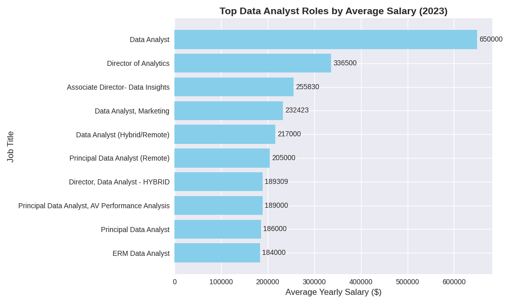
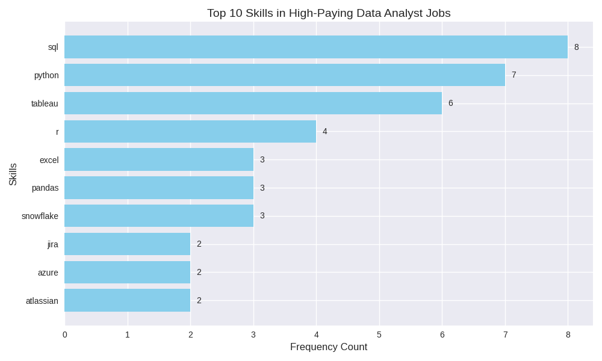
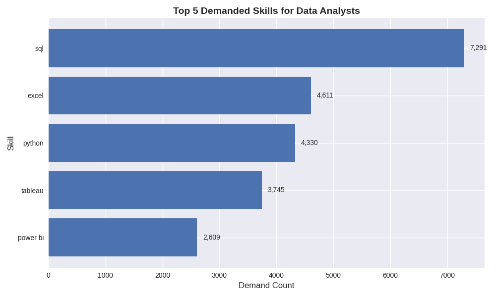
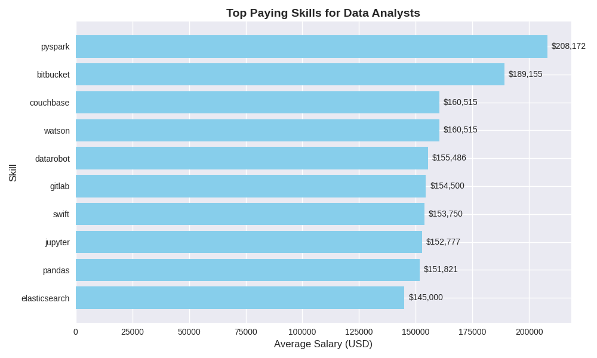
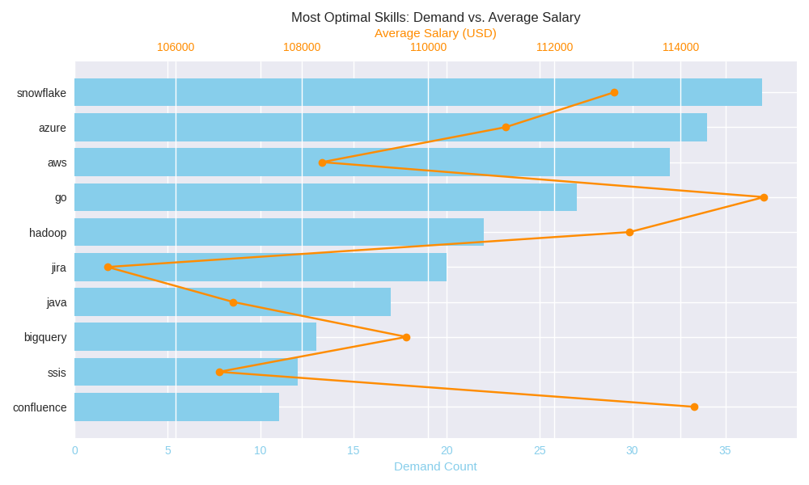

# Introduction
    This project dives into the data analytics job market, with a focus on data analyst roles. It highlights:
- 💰 The highest-paying positions
- 🔥 The most in-demand skills
- ✅ Where strong demand aligns with competitive salaries
All insights are powered by SQL queries, which you can explore in the linked repository.[Project_1_folder](/Project_1/)


# Background
📚 Background
This project was created to help navigate the data analyst job market more effectively. The goal is to identify:
-  Top-paying roles
-  The most in-demand skills
-  Insights that streamline the search for the best opportunities
The dataset comes from Luke Barousse SQL Course, which provides detailed information on job titles, salaries, locations, and essential skills.

## Key Questions Explored
Through my SQL queries, I set out to answer:
-  Which data analyst jobs pay the most?
-  What skills are required for these top-paying roles?
-  Which skills are most in demand across the industry?
-  Which skills are linked to higher salaries?
-  What are the most optimal skills to learn for career growth

# Tools I Used
To explore the data analyst job market, I relied on a set of powerful tools:
- **SQL** → The backbone of my analysis, enabling me to query databases and uncover critical insights.
- **PostgreSQL** → My chosen database management system, ideal for handling job posting data efficiently.
- **Visual Studio Code** → My go-to editor for managing databases and executing SQL queries seamlessly.
- **Git & GitHub** → Essential for version control and sharing my SQL scripts, ensuring collaboration and project tracking

# The Analysis
Each SQL query in this project was designed to investigate a specific aspect of the data analyst job market. Here’s how I approached the first question:
### 1.Top-Paying Data Analyst Jobs
- I filtered job postings by average yearly salary and location, with a focus on remote roles.
- This query highlights the most lucrative opportunities available to data analysts

```sql
SELECT
    job_id,
    job_title,
    job_location,
    job_schedule_type,
    salary_year_avg,
    job_posted_date,
    name AS company_name
FROM
    job_postings_fact
LEFT JOIN company_dim ON company_dim.company_id=job_postings_fact.company_id
WHERE
job_title_short = 'Data Analyst' AND
salary_year_avg IS NOT NULL AND
job_location = 'Anywhere'
ORDER BY
salary_year_avg DESC
LIMIT 10
```
### 💼 Top Data Analyst Jobs (2023)
My SQL queries revealed three key insights about the highest-paying roles in data analytics:
- Wide Salary Range
- The top 10 data analyst positions span from $184,000 to $650,000, showing the strong earning potential in this field.
- Diverse Employers
- Leading companies such as SmartAsset, Meta, and AT&T are among those offering competitive salaries, reflecting demand across multiple industries.
- Variety of Job Titles
- Roles range from Data Analyst to Director of Analytics, highlighting the breadth of opportunities and specializations available.


*Bar chart visualization for top 10 Data Analyst roles and their average salaries ; This Chart is generated by Copilot from my SQL results.*

### 2. Skills for Top-Paying Jobs
To uncover the skills required for the highest-paying roles, I joined job postings with skills data. This analysis reveals the specific capabilities employers value most when offering high compensation packages

```sql
WITH top_paying_jobs AS (
    SELECT
        job_id,
        job_title_short,
        salary_year_avg,
        name AS company_name
    FROM
        job_postings_fact
    LEFT JOIN company_dim ON company_dim.company_id=job_postings_fact.company_id
    WHERE
    job_title_short = 'Data Analyst' AND
    salary_year_avg IS NOT NULL AND
    job_location = 'Anywhere'
    ORDER BY
    salary_year_avg DESC
    LIMIT 10
    )

, top_skill AS ( 
    SELECT 
    top_paying_jobs.*,
    skills
FROM
    top_paying_jobs
INNER JOIN skills_job_dim ON skills_job_dim.job_id=top_paying_jobs.job_id
INNER JOIN skills_dim ON skills_job_dim.skill_id=skills_dim.skill_id
ORDER BY
    salary_year_avg DESC
)
SELECT
    skills,
    COUNT(skills) AS skills_count
FROM 
top_skill
GROUP BY
skills
ORDER BY
skills_count DESC
LIMIT 10
```

*The bar graph visualizing the top 10 Data Analyst skills base on their frequency; This chart is generated by Copilot using the result from my SQL query above.*
### Most Demanded Skills (Top 10)
From the analysis of the top-paying data analyst jobs in 2023, these skills stand out:
- SQL – leading with 8 mentions
-  Python – close behind with 7 mentions
-  Tableau – highly sought after with 6 mentions
-  R – appearing 4 times
-  Snowflake – 3 mentions
-  Pandas – 3 mentions
-  Excel – 3 mentions
-  Atlassian – 2 mentions
-  Azure – 2 mentions
-  Jira – 2 mentions

### 3. In-Demand Skills for Data Analysts
This query identified the skills most frequently requested in job postings, helping to spotlight the areas where demand is highest. These insights guide professionals toward the skills that matter most in today’s market.

```sql
SELECT 
    job_location,
    skills,
    COUNT(skills_job_dim.job_id) AS demand_count
FROM job_postings_fact
INNER JOIN skills_job_dim ON skills_job_dim.job_id=job_postings_fact.job_id
INNER JOIN skills_dim ON skills_job_dim.skill_id=skills_dim.skill_id
WHERE
    job_title_short = 'Data Analyst' AND
    job_location = 'Anywhere'
GROUP BY
    skills,job_location
ORDER BY
    demand_count DESC
LIMIT 5
```


*The bar chart visualizing the top 5 most demanded skills for Data Analyst; this chart is generated by Copilot using my SQL query result above.*

### Insight
**SQL** dominates the market with over 7,000 mentions, making it the most essential skill for data analysts. Excel and Python follow closely, highlighting the continued importance of both traditional spreadsheet expertise and modern programming. Visualization tools like Tableau and Power BI also rank highly, reflecting the industry’s strong demand for professionals who can transform data into actionable insights.

### 4.Top Skills Salary

By analyzing the average salaries linked to different skills, I uncovered which ones deliver the highest financial rewards. This approach highlights how certain technical proficiencies not only drive demand but also elevate earning potential, helping professionals prioritize skills that maximize career growth.

```sql
SELECT 
    skills,
    ROUND(AVG(salary_year_avg), 0) AS avg_salary
FROM job_postings_fact
INNER JOIN skills_job_dim ON skills_job_dim.job_id=job_postings_fact.job_id
INNER JOIN skills_dim ON skills_job_dim.skill_id=skills_dim.skill_id
WHERE
    job_title_short = 'Data Analyst' AND
    salary_year_avg IS NOT NULL AND
    job_work_from_home = 'True'
GROUP BY
    skills
ORDER BY
    avg_salary DESC
LIMIT 25
```
### Top Paying Skills for Data Analysts
**- Big Data & Machine Learning Expertise**
Analysts skilled in technologies like Spark, Hadoop, Couchbase, and ML tools such as DataRobot, Jupyter, plus Python libraries (Pandas, NumPy) command the highest salaries. These skills reflect the premium placed on advanced data processing and predictive modeling.

**- Software Development & Deployment Proficiency**
Knowledge of tools like GitLab, Jenkins, Apache Airflow highlights the lucrative crossover between analytics and engineering. Employers value skills that enable automation and efficient data pipeline management.

**- Cloud Computing & Data Engineering**
Familiarity with platforms such as Elasticsearch, Databricks, GCP underscores the growing importance of cloud-based analytics. Cloud proficiency significantly boosts earning potential in data analytics roles.


*Bar Chart visualizing top 10 paying  skills for Data Analyst ; The chart is generated by Copilot using the SQL query result above.*

### 5.Optinal Skills
**Most Optimal Skills to Learn**
By combining insights from both demand and salary data, I identified the skills that are not only highly sought after but also command strong compensation. This dual perspective provides a strategic roadmap for skill development, helping professionals focus on areas that maximize both career opportunities and earning potential.

```sql

SELECT
    skills_dim.skill_id,
    skills_dim.skills,
    COUNT(skills_job_dim.job_id) AS demand_count,
    ROUND(AVG(job_postings_fact.salary_year_avg), 0) AS avg_salary
FROM job_postings_fact
INNER JOIN skills_job_dim ON skills_job_dim.job_id=job_postings_fact.job_id
INNER JOIN skills_dim ON skills_dim.skill_id=skills_job_dim.skill_id
WHERE
    job_title_short = 'Data Analyst' AND
    salary_year_avg IS NOT NULL AND
    job_work_from_home = 'True'
GROUP BY
    skills_dim.skill_id
HAVING
    COUNT(skills_job_dim) > 10
ORDER BY
    avg_salary DESC,
    demand_count DESC
LIMIT 25
```

*The Bar chart visualizing the optimal skills base on their demand and average salary; The chart is generated by Copilot using the results from my SQL query above*

### Insight
This visualization makes it clear that:
- **Snowflake**, **Azure**, and **AWS** stand out with relatively high demand counts, making them strategic skills to learn.
- **Go** and **Confluence**, while less in demand, command strong average salaries, showing niche expertise can pay off.
- **Hadoop** and **BigQuery** balance moderate demand with solid salary levels, highlighting their relevance in big data environments.
👉 Together, this chart helps identify the most optimal skills — those that combine market demand with financial reward — giving you a clear roadmap for prioritizing skill development.

# What I Learned
**- Advanced Query Crafting**
Mastered complex SQL queries, confidently merging tables and using WITH clauses to build temporary tables with precision.
**-  Data Aggregation Mastery**
Leveraged GROUP BY alongside aggregate functions like COUNT() and AVG() to summarize and interpret data effectively.
**- Analytical Problem-Solving**
Transformed real-world questions into actionable SQL queries, sharpening my ability to uncover insights and solve practical challenges.

# Conclusion

### Key Insights
 
**- Top-Paying Roles**
Remote data analyst jobs can reach extraordinary salaries, with the highest recorded at $650,000.

**- Skills Driving High Pay**
Advanced proficiency in SQL consistently appears in top-paying roles, making it a critical skill for maximizing earnings.

**- Most In-Demand Skill**
SQL also dominates demand across the job market, reinforcing its importance for job seekers.

**- Premium on Specialized Skills**
Niche expertise in tools like SVN and Solidity is linked to the highest average salaries, showing the market rewards specialization.

**- Optimal Skill for Market Value**
With both high demand and strong salary offers, SQL stands out as one of the most strategic skills for data analysts to learn.

### 🔚 Closing Thoughts
This project not only strengthened my SQL expertise but also provided valuable insights into the data analyst job market. The findings serve as a practical guide for prioritizing skill development and targeting job search efforts. By focusing on high-demand and high-salary skills, aspiring data analysts can position themselves more competitively. Above all, this exploration underscores the importance of continuous learning and adapting to emerging trends, ensuring long-term growth in the evolving field of data analytics.


